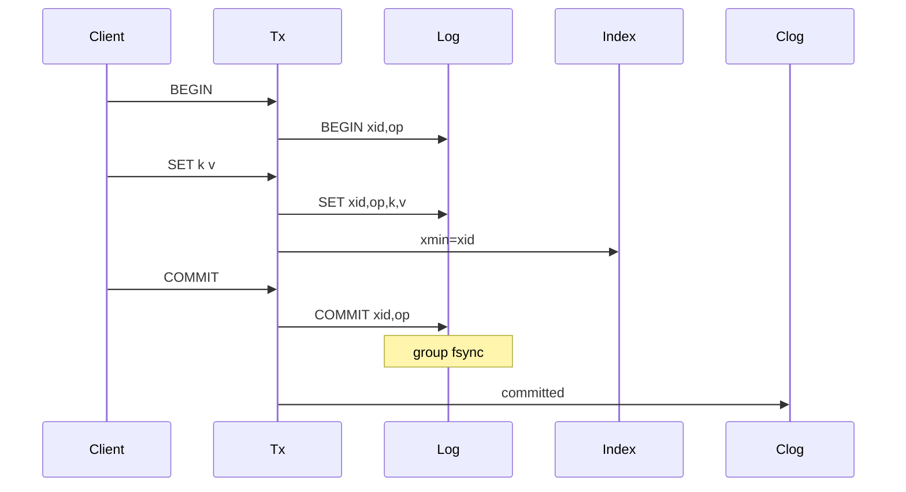

<!--
Copyright (c) 2026 Kiruba Sankar Swaminathan

This source code is licensed under the MIT license found in the
LICENSE file in the root of this source tree.
-->

# TurnstoneDB

**TurnstoneDB** is a persistent, transactional key-value store written in Go. Each server process holds multiple isolated databases on local disk. Optional leader-follower replication is configured explicitly per database — there is no built-in sharding, consensus, or automatic cluster failover.

> **Disclaimer:** TurnstoneDB is research-quality software. It implements group commit, MVCC, mTLS, and punch-hole vacuum, but it is not recommended for mission-critical production use without further hardening.

## What it is

- A **single-node** storage engine with Redis-style `SELECT <db>` namespaces
- **ACID transactions** with snapshot isolation and first-writer-wins key locking
- **Optional replication** — one primary and manually attached followers per database
- **CDC** — stream committed changes to JSONL for ETL/analytics

## What it is not

- Not a distributed database (no partition tolerance, no client-side routing, no Raft)
- Not a managed cluster — failover is manual via `stepdown` / `promote` / `replicaof`
- Not SQL — keys and opaque byte values only

---

## Features

| Area | Detail |
| --- | --- |
| Storage | Single append-only `data.log` + segmented mmap hash index (`index/seg-*.bin`) |
| Durability | Eager append on `SET`/`DEL`; group fsync on `COMMIT` |
| Vacuum | Drop dead MVCC versions; reclaim disk with sparse punch-hole |
| Security | mTLS on all connections; RBAC via X.509 certificate Organization |
| Replication | Async or sync (quorum ack); timeline fork on `promote` |
| Observability | Prometheus metrics on `:9090` |

---

## Quick start

### Prerequisites

- Go 1.25+ (see `go.mod`)

### Build

```bash
git clone https://github.com/kirubasankars/turnstone.git
cd turnstone
make build
```

### Initialize

Generate a home directory with TLS certificates and default config:

```bash
./bin/turnstone-generate-config -home tsdata -ip 192.168.1.10,myserver.local
```

### Run

```bash
./bin/turnstone -home tsdata
```

The server listens on `:6379` by default. Databases `0`–`N` are independent keyspaces (`number_of_databases` in config).

---

## CLI usage

The CLI reads certificates from `--home`. Admin commands require the `-admin` flag.

```bash
./bin/turnstone-cli -home tsdata
```

All reads and writes run inside a transaction:

```bash
> select 1
OK
> begin
OK
> set mykey "hello"
OK
> get mykey
OK: hello
> commit
OK
```

Batch operations (`mset`, `mget`, `mdel`) also require an active transaction.

---

## Replication and failover

Replication is **per database**, not whole-server. Each database follows a small state machine:

`UNDEFINED` → `REPLICA` → `PRIMARY`

Admin commands (via `turnstone-cli -admin`):

| Command | Effect |
| --- | --- |
| `replicaof <host:port> <db>` | Follow a remote primary (REPLICA state) |
| `stepdown` | Drain writes, sync followers, return to UNDEFINED |
| `promote [min_replicas]` | Become primary; bumps timeline ID; optional sync quorum |

### Manual failover (A → B)

1. **Node A:** `select 1` → `stepdown`
2. **Node B:** `select 1` → `promote`
3. **Node A:** `select 1` → `replicaof <B>:6379 1`

There is no automatic leader election. Timelines record history forks so promotion after a split is safe, but an operator must invoke it.

---

## CDC and analytics

**CDC mode** tails committed changes to JSONL:

```bash
# Edit tsdata/turnstone.cdc.json, then:
./bin/turnstone -mode cdc -home tsdata
```

---

## Configuration (`turnstone.json`)

| Field | Default | Description |
| --- | --- | --- |
| `id` | hostname-based | Node identifier |
| `port` | `:6379` | Listen address |
| `max_conns` | `1000` | Max concurrent connections |
| `number_of_databases` | `4` | Logical databases (`0` … `N`) |
| `wal_retention_strategy` | `replication` | Purge policy: `replication` or `time` |
| `max_disk_usage_percent` | `90` | Reject writes above this disk usage |
| `metrics_addr` | `:9090` | Prometheus scrape address |
| `tls_cert_file` | `certs/server.crt` | Server certificate |
| `tls_client_cert_file` | `certs/server.crt` | Cert for outbound replication |

---

## Storage engine

```
Client SET/DEL  →  append data.log  →  update segmented hash index
Client COMMIT   →  append + fsync COMMIT  →  clog[xid] = committed
Client GET      →  index lookup  →  ReadAt(offset) from data.log
Open            →  replay data.log (SEEK_DATA skips holes)  →  rebuild index + clog
Vacuum          →  drop dead versions  →  punch-hole stale ranges
```

### Components

1. **`data.log`** — one unbounded append-only file. Records: `BEGIN`, `SET`, `DEL`, `COMMIT`, `ABORT` (keys and values inline).
2. **`index/seg-*.bin`** — 256-segment mmap hash index. Each user key holds an MVCC version chain pointing at log offsets. Rebuilt from replay on every open.
3. **In-memory clog** — transaction commit status, rebuilt during replay.
4. **Vacuum** — removes dead index entries; `fallocate(PUNCH_HOLE|KEEP_SIZE)` on stale byte ranges behind the append tail and below the replication scan floor.

### Transaction model (eager logging)

Writes are logged immediately at `SET`/`DEL` time, not buffered until commit:



Notable semantics:

- **`xid` at `BEGIN`**, **`opID` per record** — `opID` is the replication/CDC cursor.
- **First-writer-wins** — `SET`/`DEL` takes a NOWAIT key lock; conflicts return immediately, no deadlock.
- **Read-set validation at `COMMIT`** — detects stale reads / write skew under snapshot isolation.
- **Read-your-own-writes** — uncommitted versions with `xmin == my xid` are visible inside the transaction.
- **Aborts are explicit** — conflicts, disconnects, and timeouts append `ABORT`; a reaper aborts transactions exceeding `MaxTxDuration`.

Replication streams differ by role: `server` replicas see the full physical log; `cdc` consumers see committed `SET`/`DEL` only.

---

## Limitations

1. **Single node** — one process, local disk. Scale-out requires application-level sharding.
2. **Manual failover** — no Raft/Paxos; an operator runs `stepdown` / `promote`.
3. **No lock waiting** — hot-key contention surfaces as immediate `TxConflict`; clients must retry.
4. **Breaking on-disk format** — the current `data.log` + segmented hash index layout is not compatible with older WAL/VLog/LevelDB directories.

---

## License

MIT — see [LICENSE](LICENSE).
