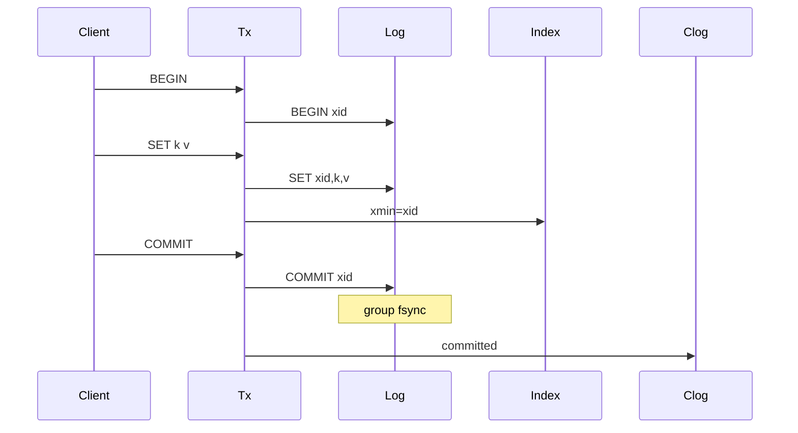

<!--
Copyright (c) 2026 Kiruba Sankar Swaminathan

This source code is licensed under the MIT license found in the
LICENSE file in the root of this source tree.
-->

# TurnstoneDB

**TurnstoneDB** is a persistent, transactional key-value store written in Go. Each server process holds multiple isolated databases on local disk. Optional leader-follower replication is configured explicitly per database — there is no built-in sharding, consensus, or automatic cluster failover.

> **Disclaimer:** TurnstoneDB is research-quality software. It implements group commit, MVCC, and mTLS, but it is not recommended for mission-critical production use without further hardening.

## What it is

- A **single-node** storage engine with Redis-style `SELECT <db>` namespaces
- **ACID transactions** with snapshot isolation and first-writer-wins key locking
- **Optional replication** — one primary and manually attached followers per database

## What it is not

- Not a distributed database (no partition tolerance, no client-side routing, no Raft)
- Not a managed cluster — failover is manual via `stepdown` / `promote` / `replicaof`
- Not SQL — keys and opaque byte values only

---

## Features

| Area | Detail |
| --- | --- |
| Storage | Segmented WAL (`wal/seg-*.wal`) + global byte LSN + in-memory sharded hash index arena |
| Durability | Eager append on `SET`/`DEL`; group fsync on `COMMIT` |
| Retention | Scan floor, MVCC-aware segment delete, optional copy-forward and index compaction |
| Security | mTLS on all connections; RBAC via X.509 certificate Organization |
| Replication | Async or sync (quorum ack); byte-offset streaming from leader WAL |
| Observability | Prometheus metrics on `:9090` |

---

## Quick start

### Prerequisites

- Go 1.25+ (see `go.mod`)

### Build

```bash
git clone https://github.com/kirubasankars/turnstone.git
cd turnstone
make build
```

### Initialize

Generate a home directory with TLS certificates and default config:

```bash
./bin/turnstone init --home tsdata --ip 192.168.1.10,myserver.local
```

### Run

```bash
./bin/turnstone server --home tsdata
```

For local development (auto-promote all databases, no transaction timeouts):

```bash
./bin/turnstone server --home tsdata --dev
```

The server listens on `:6379` by default. Databases `0`–`N` are independent keyspaces (`number_of_databases` in config).

---

## CLI usage

The interactive client reads certificates from `--home`. Admin commands require the `--admin` flag.

```bash
./bin/turnstone cli --home tsdata
```

All reads and writes run inside a transaction:

```bash
> select 1
OK
> begin
OK
> set mykey "hello"
OK
> get mykey
OK: hello
> commit
OK
```

Batch operations (`mset`, `mget`, `mdel`) also require an active transaction.

### Commands

| Command | Purpose |
| --- | --- |
| `turnstone init` | Create home directory, TLS certs, and `turnstone.json` |
| `turnstone server` | Run the database server |
| `turnstone cli` | Interactive client REPL |
| `turnstone bench` | Load and throughput benchmark |

Global flag: `--home` (default `tsdata`) applies to all subcommands.

Benchmark example:

```bash
./bin/turnstone bench --home tsdata --addr localhost:6379 --ops 10000 --concurrency 50
```

---

## Replication and failover

Replication is **per database**, not whole-server. Each database follows a small state machine:

`UNDEFINED` → `REPLICA` → `PRIMARY`

Admin commands (via `turnstone cli --admin`):

| Command | Effect |
| --- | --- |
| `replicaof <host:port> <db>` | Follow a remote primary (REPLICA state) |
| `stepdown` | Drain writes, sync followers, return to UNDEFINED |
| `promote [min_replicas]` | Become primary; optional sync quorum |

### Manual failover (A → B)

1. **Node A:** `select 1` → `stepdown`
2. **Node B:** `select 1` → `promote`
3. **Node A:** `select 1` → `replicaof <B>:6379 1`

There is no automatic leader election. An operator must invoke failover.

---

## Configuration (`turnstone.json`)

| Field | Default | Description |
| --- | --- | --- |
| `id` | hostname-based | Node identifier |
| `port` | `:6379` | Listen address |
| `max_conns` | `1000` | Max concurrent connections |
| `number_of_databases` | `4` | Logical databases (`0` … `N`) |
| `log_retention` | `replication` | Purge policy: `replication` or `none` |
| `max_disk_usage_percent` | `90` | Reject writes above this disk usage |
| `metrics_addr` | `:9090` | Prometheus scrape address |
| `tls_cert_file` | `certs/server.crt` | Server certificate |
| `tls_client_cert_file` | `certs/server.crt` | Cert for outbound replication |

---

## Storage engine

```
Client SET/DEL  →  append wal/seg-*.wal  →  update sharded hash index
Client COMMIT   →  append + fsync COMMIT  →  clog[xid] = committed
Client GET      →  index lookup  →  ReadAt(global LSN) from WAL
Open            →  replay WAL segments  →  rebuild index + clog
Retention       →  scan floor  →  index compact / copy-forward / segment delete
```

### On-disk layout

Each database directory contains:

```
<db>/
  wal/
    manifest.json    # segment list, active segment, segment size
    seg-000001.wal   # sealed segments
    seg-000002.wal
    ...
  repl.slots         # replication follower ack positions (when used)
```

### Components

1. **Segmented WAL** — append-only log split into rotating segments (default **64 MiB** per segment). Each frame has a CRC32 header. A **global byte LSN** spans all segments, so index offsets and replication cursors stay stable across rotation.
2. **In-memory index** — 256-shard hash arena (ephemeral runtime cache). Rebuilt from WAL replay on open and dropped on close. Only the WAL is durable.
3. **In-memory clog** — transaction commit status, rebuilt during replay.

### Retention and maintenance

When `log_retention` is `replication` (default), a background pass raises the **scan floor** from the tightest of:

- local retention mark (`MarkRetention`)
- slowest registered follower ack
- leader-propagated safe point

Then `RunWalMaintenance()` runs, in order:

1. **Index compaction** (default on) — MVCC-aware prune of stale version chains; reclaims arena space when fragmentation exceeds ~3× live bytes.
2. **WAL copy-forward** (default on) — when allocated WAL bytes exceed ~3× live bytes, copies MVCC-visible frames into a fresh segment, remaps index offsets, then deletes old segments. Skips while write transactions are active; read-only snapshots still pin older frames.
3. **Segment delete** — removes sealed segments at or below the effective delete floor (`min(scan floor, MVCC-visible min offset)`).

Bytes below the scan floor return `ErrLogUnavailable` for `ScanLog` / replication replay. Physical deletion respects replication and snapshot constraints.

### Transaction model (eager logging)

Writes are logged immediately at `SET`/`DEL` time, not buffered until commit:



Notable semantics:

- **Replication cursor** — handshake, acks, and retention use the exclusive-end **global byte LSN** in the WAL, not the transaction `xid`.
- **`xid` at `BEGIN`** — a monotonic transaction id stored inside log records.
- **First-writer-wins** — `SET`/`DEL` takes a NOWAIT key lock; conflicts return immediately, no deadlock.
- **Read-set validation at `COMMIT`** — detects stale reads / write skew under snapshot isolation.
- **Read-your-own-writes** — uncommitted versions with `xmin == my xid` are visible inside the transaction.
- **Aborts are explicit** — conflicts, disconnects, and timeouts append `ABORT`; a reaper aborts transactions exceeding `MaxTxDuration`.

Replication streams raw physical WAL byte ranges (possibly spanning segment boundaries) to follower replicas.

---

## Limitations

1. **Single node** — one process, local disk. Scale-out requires application-level sharding.
2. **Manual failover** — no Raft/Paxos; an operator runs `stepdown` / `promote`.
3. **No lock waiting** — hot-key contention surfaces as immediate `TxConflict`; clients must retry.
4. **On-disk format** — segmented WAL under `wal/` with a global byte LSN. Not compatible with older monolithic-log or LevelDB directory layouts.

---

## License

MIT — see [LICENSE](LICENSE).
