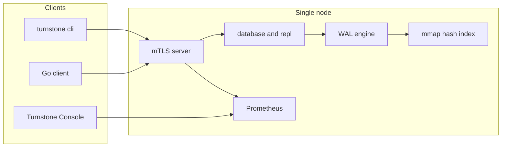

<!--
Copyright (c) 2026 Kiruba Sankar Swaminathan

This source code is licensed under the MIT license found in the
LICENSE file in the root of this source tree.
-->

# TurnstoneDB

A persistent, transactional key-value database in one Go binary.

TurnstoneDB stores byte values under ASCII keys on local disk. You open a home directory, get mTLS on `:6379`, and split work across logical databases (`SELECT 0`, `SELECT 1`, …). The CLI looks Redis-like. The engine is not: writes append a segmented WAL, `COMMIT` group-fsyncs, and readers use snapshot isolation.

Replication is optional and per database. Physical WAL backup is the disaster-recovery path. There is no Raft, no sharding, and no automatic failover — it is a **single-node store**.

> **Disclaimer:** Research-quality software. Group commit, MVCC, mTLS, mmap hash indexes, and physical replication are implemented; it is not recommended for mission-critical production use without further hardening.

## What you get

- ACID transactions with snapshot isolation and first-writer-wins conflicts
- One process, one home directory, Redis-style `SELECT` namespaces
- Optional primary → follower replication and sync quorum (`promote N`)
- Full and differential physical WAL backup / restore
- Prometheus metrics and a localhost **Turnstone Console** for development

Not included: SQL, secondary indexes, blocking lock waits, consensus, or scale-out.



On Unix the hash index lives in anonymous mmap arenas (heap fallback elsewhere) and is **rebuilt from the WAL on every open**. WAL segments are file-backed `mmap` with `madvise`; values are assembled from an 8 KiB `shared_buffers` page pool. WAL retention can compact fragmented shards, copy live frames forward, and drop sealed segments. Cap index memory with `max_index_arena_bytes`.

---

## Quick start

**Prerequisites:** Go 1.26+ (see `go.mod`)

```bash
git clone https://github.com/kirubasankars/turnstone.git
cd turnstone
make build
```

```bash
# 1. Home directory: certs + turnstone.json
./bin/turnstone init --home tsdata --ip 127.0.0.1,localhost

# 2. Dev server: auto-promote, no tx timeouts, Console on :8080
./bin/turnstone server --home tsdata --dev

# 3. CLI (another terminal)
./bin/turnstone cli --home tsdata
```

```text
0> begin
OK
0> set mykey hello
OK
0> commit
OK
0> begin read
OK
0> get mykey
OK: hello
0> commit
OK
```

Default listen address is `:6379`. Console: **http://127.0.0.1:8080**. Databases `0`–`N` are independent keyspaces.

Without `--dev`, databases start in `UNDEFINED` and must be `promote`d before they accept writes.

---

## Transactions

Keys are ASCII; values are opaque bytes. The WAL is the source of truth. Every `get` / `set` / `del` (and the multi-key variants) requires an open transaction.

| Command | Effect |
| --- | --- |
| `begin` | Snapshot-isolated read/write transaction |
| `begin read` | Read-only snapshot (no write locks) |
| `set` / `del` | Eager WAL append |
| `commit` | Group `fsync`, then mark committed |
| `abort` | Discard; uncommitted versions stay invisible |

A second writer on the same key gets `ErrTxConflict` immediately (`NOWAIT`) and must retry. Production servers abort transactions older than 30 seconds; `--dev` turns that reaper off.

---

## Commands

Flag reference: **[docs/cli.md](docs/cli.md)**

| Command | Purpose |
| --- | --- |
| `turnstone init` | Create home directory, TLS certs, and `turnstone.json` |
| `turnstone server` | Run the database (`--dev` adds the Console) |
| `turnstone cli` | Interactive REPL or `cli exec <command>` |
| `turnstone bench` | Load test (`--ops` or `--duration`) |
| `turnstone backup` | Stream a physical WAL backup from a primary |
| `turnstone restore` | Restore a backup chain into a new home directory |

### REPL

Data commands need a transaction. `cli exec` uses a fresh connection, so run `begin` / `set` / `commit` in the interactive REPL.

| Command | Role | Notes |
| --- | --- | --- |
| `ping` | client | Health check |
| `select <db>` | client | Switch logical database |
| `begin` / `begin read` | client | Start a transaction |
| `get` / `mget` | client | Read |
| `set` / `mset` | client | Write |
| `del` / `mdel` | client | Delete |
| `commit` / `abort` | client | Finish the transaction |
| `stat` | client | Replication state, offsets, replica lag |
| `promote [min_replicas]` | admin | Become `PRIMARY`; optional sync quorum |
| `stepdown` | admin | Drain writes → `UNDEFINED` |
| `replicaof <host:port> <db>` | admin | Follow a remote primary |
| `flushdb` | admin | Wipe the selected database |

```bash
./bin/turnstone cli exec ping
./bin/turnstone cli --admin exec promote
./bin/turnstone bench --home tsdata --ops 10000 --concurrency 50
./bin/turnstone bench --home tsdata --duration 30s --concurrency 50
```

---

## Turnstone Console

With `--dev`, a read-only dashboard listens on **http://127.0.0.1:8080** (override with `--console-addr`). Localhost only — not a production admin UI. Mutate data with `turnstone cli`.

| Section | Contents |
| --- | --- |
| **Dashboard** | Key counts, WAL/hash segment counts, arena / live / GC bytes, Prometheus tiles |
| **Metrics** | Time-series charts for server and per-database gauges |

---

## Replication and failover

Each database is independently `UNDEFINED` → `REPLICA` → `PRIMARY`. An operator moves it; there is no leader election.

| Admin command | Effect |
| --- | --- |
| `replicaof <host:port> <db>` | Follow a remote primary |
| `stepdown` | Drain writes and return to `UNDEFINED` |
| `promote [min_replicas]` | Become primary; optional sync quorum |

**Manual failover (A → B) on database `1`:**

1. **A:** `select 1` → `stepdown`
2. **B:** `select 1` → `promote`
3. **A:** `select 1` → `replicaof <B>:6379 1`

`promote N` with N > 0 waits for N follower ACKs after each commit. Backup streams do not count toward quorum.

---

## Backup and restore

Back up a running primary; restore offline into a **new** home directory:

```bash
./bin/turnstone backup --home tsdata --host localhost:6379 --db 1 --out backup_full

./bin/turnstone backup --home tsdata --db 1 --type differential \
  --base-meta backup_full/backup.meta --out backup_diff

./bin/turnstone restore --chain backup_full,backup_diff --out restored_home
./bin/turnstone server --home restored_home --dev
```

`backup.meta`, chain validation, and LSN rules: **[docs/cli.md](docs/cli.md)**.

---

## Configuration and security

```
tsdata/
  turnstone.json
  certs/               # CA, server, client, admin
  data/
    0/                 # logical database 0
    1/
    ...
```

Highlights in `turnstone.json` (all fields: [config/README.md](config/README.md)):

| Field | Default | Description |
| --- | --- | --- |
| `port` | `:6379` | Listen address |
| `number_of_databases` | `4` | Highest logical database id (`0` … `N`) |
| `log_retention` | `replication` | WAL purge: `replication` or `none` |
| `max_disk_usage_percent` | `90` | Reject writes above this disk usage |
| `max_index_arena_bytes` | `0` | Reject writes when index arenas exceed this (bytes); `0` disables |
| `metrics_addr` | `:9090` | Prometheus scrape address |

Every connection is **mTLS**. Role is the certificate **Organization** field:

| Organization | Allowed to |
| --- | --- |
| `client` | Data commands and `stat` |
| `admin` | `promote`, `stepdown`, `replicaof`, `flushdb` |
| `server` | Replication streams between nodes |

`turnstone cli` uses `certs/client.crt`; pass `--admin` for the admin pair.

---

## Go client

Package [`turnstone/client`](client/README.md). Load the CA and a client cert from `--home`.

```go
package main

import (
	"errors"
	"fmt"
	"log"

	"turnstone/client"
)

func main() {
	cl, err := client.NewMTLSClientHelper(
		"localhost:6379",
		"tsdata/certs/ca.crt",
		"tsdata/certs/client.crt",
		"tsdata/certs/client.key",
		nil,
	)
	if err != nil {
		log.Fatal(err)
	}
	defer cl.Close()

	if err := cl.Begin(); err != nil {
		log.Fatal(err)
	}
	if err := cl.Set("mykey", []byte("hello")); err != nil {
		log.Fatal(err)
	}
	if err := cl.Commit(); err != nil {
		if errors.Is(err, client.ErrTxConflict) {
			// retry with a new transaction
		}
		log.Fatal(err)
	}

	if err := cl.BeginReadOnly(); err != nil {
		log.Fatal(err)
	}
	val, err := cl.Get("mykey")
	if err != nil {
		log.Fatal(err)
	}
	fmt.Printf("%s\n", val)
	_ = cl.Commit()
}
```

Retry `ErrTxConflict` and `ErrServerBusy` with backoff. The engine does not wait on key locks.

---

## Observability

| Surface | Address | Use |
| --- | --- | --- |
| Prometheus | `:9090` | Server and per-database gauges (`turnstone_*`) |
| Turnstone Console | `127.0.0.1:8080` (`--dev`) | Dashboard, WAL/index GC, charts |
| `stat` | CLI | JSON replication state, offsets, replica lag |

---

## Faster than PostgreSQL (on KV)

Turnstone is not a SQL database. On durable point GET/SET it can outrun
PostgreSQL because the hot path is a hash probe + group `fdatasync`, not
parse/plan/btree. The engine defaults match a fair comparison: no commit
sleep, Unix `fdatasync`, no `BEGIN` WAL record, open WAL file descriptors,
and a 64 MiB value cache.

How to measure and what not to compare: **[docs/performance.md](docs/performance.md)**.

```bash
make bench
scripts/bench-vs-postgres.sh   # Postgres side runs only if psql can connect
```

## Limitations

1. **Single node** — one process, local disk; scale-out is application sharding.
2. **Manual failover** — operators run `stepdown` / `promote`.
3. **No lock waiting** — hot-key conflicts return immediately.
4. **Keys and bytes only** — not SQL.

---

## Documentation

| Topic | Guide |
| --- | --- |
| CLI reference | [docs/cli.md](docs/cli.md) |
| Architecture and package index | [docs/README.md](docs/README.md) |
| Go client | [client/README.md](client/README.md) |
| Storage engine | [engine/README.md](engine/README.md) |
| Hash index | [engine/hashindex/README.md](engine/hashindex/README.md) |
| Replication | [database/README.md](database/README.md), [repl/README.md](repl/README.md) |
| Wire protocol | [protocol/README.md](protocol/README.md) |
| Configuration | [config/README.md](config/README.md) |

---

## License

MIT — see [LICENSE](LICENSE).
