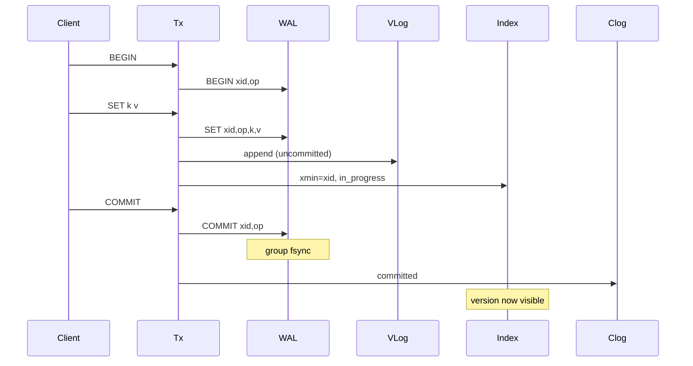

# TurnstoneDB

**TurnstoneDB** is a high-performance, persistent, distributed Key-Value store written in Go. It features a custom storage engine inspired by **WiscKey** (separating keys from values), full ACID transactions via Snapshot Isolation, and robust asynchronous replication with **Timeline** support for safe failovers.

> ⚠️ **Disclaimer:** TurnstoneDB is currently research-quality software. While it implements advanced mechanisms like Group Commit, MVCC, and mTLS, it is not recommended for mission-critical production workloads without further hardening.

## 🚀 Key Features

* **⚡ WiscKey-style Storage Engine**: Uses a custom memory-mapped B+ tree for the index (Keys) and an append-only Value Log (VLog) for values. This minimizes write amplification and drastically improves throughput for large payloads.
* **📝 Eager Logging**: `SET`/`DEL` write to the WAL, VLog, and index immediately (not buffered until `COMMIT`). `COMMIT` only group-fsyncs a small commit record and flips visibility. See "Transaction Model: Eager Logging" below.
* **🔒 ACID Transactions**: Full support for multi-key transactions with **Snapshot Isolation**. Write-write conflicts are detected eagerly at `SET`/`DEL` time via **first-writer-wins** key locking (no waiting, no deadlocks); read-set validation still runs at `COMMIT` to catch stale-read/write-skew.
* **🛡️ Secure by Default**: All connections (Client-Server and Inter-Node) are secured via **mTLS** (Mutual TLS). Role-Based Access Control (RBAC) is enforced via X.509 Certificate Organization fields.
* **📡 Replication & Timelines**: Database-level Leader-Follower replication. Supports **Timelines** to handle split-brain scenarios and allow safe history divergence during promotion.
* **🌊 Change Data Capture (CDC)**: Built-in support for streaming data changes to local JSONL logs with configurable rotation policies.
* **🦆 DuckDB Integration**: Includes a specialized loader (`turnstone-duck`) to ingest CDC streams directly into DuckDB for high-speed OLAP analytics.
* **🔭 Observability**: Built-in **Prometheus** exporter (`/metrics`) for tracking active transactions, conflicts, WAL size, and replication lag.

---

## 📦 Installation & Getting Started

### Prerequisites

* Go 1.22 or higher.

### 1. Build the Binaries

```bash
# Clone the repository
git clone https://github.com/yourusername/turnstone.git
cd turnstone

# Build server and tools
make build
# OR manually:
# go build -o bin/turnstone ./cmd/turnstone
# go build -o bin/turnstone-cli ./cmd/turnstone-cli
# go build -o bin/turnstone-generate-config ./cmd/turnstone-generate-config

```

### 2. Initialize Configuration & Certificates

TurnstoneDB requires mTLS certificates. Use the generator tool to create a complete environment with a CA, server/client/admin certs, and default config files.

```bash
# Create a data directory and generate artifacts
# -ip allows adding SANs (Subject Alternative Names) for remote access
./bin/turnstone-generate-config -home tsdata -ip 192.168.1.10,myserver.local

# Output:
# Certificates generated in: tsdata/certs
# Sample configuration written to tsdata/turnstone.json

```

### 3. Start the Server

```bash
./bin/turnstone -home tsdata

```

* Listens on `:6379` by default.
* **Note**: Database `0` is reserved as a read-only system database. User data goes into Databases `1` through `16` (configurable).

---

## 💻 Usage

### Using the CLI (`turnstone-cli`)

The CLI automatically detects certificates in the `--home` directory. You must use the `-admin` flag to perform cluster management operations.

```bash
# Connect to the server
./bin/turnstone-cli -home tsdata

```

#### Basic Commands

**Note:** All data operations (`get`, `set`, `del`) must be performed inside a transaction block (`begin` ... `commit`).

```bash
> select 1
OK

# Start a Transaction
> begin
OK

# Perform Operations
> set mykey "Hello Turnstone"
OK

> get mykey
OK: Hello Turnstone

> del oldkey
OK

# Commit Changes
> commit
OK

```

#### Batch Operations (MGET / MSET)

Batch operations also require an active transaction.

```bash
> begin
OK

# Batch Set (MSET) - Atomic write of multiple keys
> mset user:1 "Alice" user:2 "Bob" user:3 "Charlie"
OK

# Batch Get (MGET) - Fetch multiple values in one round-trip
> mget user:1 user:2 user:3 non_existent_key
1) Alice
2) Bob
3) Charlie
4) (nil)

> commit
OK

```

---

## 🕹️ Cluster Management & Failover

TurnstoneDB supports manual failover handling via a specific lifecycle state machine: `UNDEFINED` -> `REPLICA` -> `PRIMARY`. These commands generally require Admin privileges.

### 1. Following a Leader (`replicaof`)

To make the current node follow another node, use `replicaof`. This puts the database into **REPLICA** state.

```bash
# Replicate Database 1 from a Leader at 10.0.0.5:6379
> select 1
> replicaof 10.0.0.5:6379 1
Replication started from 10.0.0.5:6379/1

```

### 2. Graceful Step Down (`stepdown`)

Before performing maintenance on a Primary, or to prepare for failover, issue `stepdown`. This command:

1. Blocks new write transactions.
2. Waits for active transactions to drain.
3. Ensures connected replicas are synced.
4. Transitions the database to **UNDEFINED** state (ReadOnly, no replication).

```bash
> select 1
> stepdown
OK
# All clients are now disconnected from DB 1.

```

### 3. Promoting a Node (`promote`)

To turn a node (either a Replica or an Undefined node) into a Primary, use `promote`. This bumps the **Timeline ID** (forking history safely) and enables write access.

```bash
> select 1
# Promote to Primary. Optional arg: min_replicas for synchronous replication.
> promote
OK

# OR: Promote with Synchronous Replication (Require 2 acks for every commit)
> promote 2
OK

```

### 4. Manual Failover Example

**Scenario:** Moving leadership from Node A to Node B.

1. **On Node A (Old Leader):**

```bash
> select 1
> stepdown

```

2. **On Node B (New Leader):**

```bash
> select 1
> promote

```

3. **On Node A (Old Leader):**

```bash
# Reconfigure A to follow B
> select 1
> replicaof <Node_B_IP>:6379 1

```

---

## 📡 CDC & Data Integration

### Running a Change Data Capture (CDC) Consumer

You can run a dedicated process to tail the transaction logs and output JSON for ETL pipelines.

1. **Configure:** Edit `tsdata/turnstone.cdc.json` to define the target database and output format.
2. **Run:**
```bash
./bin/turnstone -mode cdc -home tsdata

```


3. **Output:** The CDC worker writes rotation-safe JSONL files to the `output_dir`.
```json
{"seq": 101, "tx": 50, "key": "device:452", "val": {"lat": 34.05}, "ts": 1709320000}
{"seq": 103, "tx": 51, "key": "session:99", "del": true, "ts": 1709320005}

```


### Analytics with DuckDB

Use `turnstone-duck` to watch CDC logs, deduplicate them (handling the "same key updated multiple times" scenario), and upsert them into a DuckDB database.

```bash
# Watch cdc_logs, load into duckdb, and archive processed files
./bin/turnstone-duck -input tsdata/cdc_logs -archive tsdata/archive -db analytics.duckdb

```

---

## ⚙️ Configuration (`turnstone.json`)

| Field | Default | Description |
| --- | --- | --- |
| `id` | `hostname` | Unique Node ID. |
| `port` | `:6379` | TCP listening address. |
| `max_conns` | `1000` | Maximum concurrent client connections. |
| `number_of_databases` | `4` | Number of logical databases. |
| `wal_retention` | `2h` | Duration to keep WAL files. |
| `wal_retention_strategy` | `time` | Strategy for WAL purge: `time` or `replication` (wait for replicas). |
| `max_disk_usage_percent` | `90` | Reject writes if disk usage exceeds this %. |
| `block_cache_size` | `64MB` | Reserved for future index cache tuning (e.g. "128MB", "1GB"). |
| `metrics_addr` | `:9090` | Address for Prometheus metrics. |
| `tls_cert_file` | `certs/server.crt` | Server Certificate. |
| `tls_client_cert_file` | `certs/server.crt` | Cert used when acting as a Replication Client. |

---

## 🛠️ Architecture & Internals

### Architecture

TurnstoneDB separates the storage of keys and values to optimize for modern SSDs:

1. **mmap B+ Tree (Index)**: Stores `Key + (MaxUint64 - TxID) -> <FileID, Offset, Size>`. This encoding allows for efficient MVCC lookups (time-travel queries) and keeps the index compact with in-place page updates.
2. **Value Log (VLog)**: Stores the actual values on disk in append-only files. Garbage collection is performed only when a file exceeds a configurable staleness threshold.
3. **Write-Ahead Log (WAL)**: Ensures durability. Supports retention strategies based on time or replication acknowledgment. WAL rotation is checkpoint-driven (not size-triggered); checkpoints run on a timer (default 60s) or can be forced via the `checkpoint` admin command.

### Transaction Model: Eager Logging

Earlier versions of TurnstoneDB buffered all writes in memory between `BEGIN` and `COMMIT`, and only touched the WAL/VLog/index once, atomically, at commit time. TurnstoneDB now writes eagerly instead:



Key semantics:

* **`xid` is assigned at `BEGIN`**, not at commit time. Every WAL record (`BEGIN`/`SET`/`DEL`/`COMMIT`/`ABORT`) also gets its own monotonically increasing `opID`, which remains the replication cursor.
* **`SET`/`DEL` write immediately.** Values land in the VLog and an index version is inserted (`xmin = xid`, initially "in progress") as soon as the client calls `SET`/`DEL` — not buffered until `COMMIT`. This data is **not fsynced** at write time; it is recovered from the WAL on crash via WAL replay rather than fsyncing every row.
* **`COMMIT` group-fsyncs a tiny record.** Because `SET`/`DEL` already did the heavy I/O, `COMMIT` only has to append and fsync a `COMMIT` WAL record (batched with other concurrent commits), then flip the transaction's status to `committed` in the commit log (`clog`). This is cheaper and more predictable than fsyncing an entire write-set at commit time.
* **Read-your-own-writes** works without a separate write-cache: `Get` inside a transaction simply treats `xmin == my xid` as visible regardless of `clog` state.
* **Isolation is now first-writer-wins, not first-committer-wins.** `SET`/`DEL` takes an exclusive, **NOWAIT** lock on the key: if another in-progress transaction already owns it, the call fails immediately with a write conflict — there is no waiting and therefore no deadlock. The write-set/blind-write half of the old commit-time conflict check is gone since it's now structurally impossible (whoever holds the key's lock is the only writer). Read-set validation (stale-read / write-skew detection) still happens at `COMMIT` for true snapshot-isolation correctness.
* **Aborts are explicit.** Timeouts, disconnects, and conflicts all append an `ABORT` WAL record and release locks; a background reaper also force-aborts any transaction that exceeds `MaxTxDuration` even if the client goes silent, so a stalled connection can't hold a key lock forever.

#### What this means for clients

* `SET`/`DEL` (and `MSET`/`MDEL`) can now fail with **`ResStatusTxConflict` (0x05)** directly — previously this only happened at `COMMIT`. The Go client already maps this to `ErrTxConflict`.
* Once a transaction hits a conflict, it is marked aborted server-side ("current transaction is aborted" behavior): every subsequent `GET`/`SET`/`COMMIT` on that connection returns `ResStatusTxConflict` until you send `ABORT` (or a fresh `BEGIN`).
* Values are visible to other transactions only after `COMMIT` — the eager writes described above are strictly an internal engine detail; external readers never see uncommitted data (`Get`/`StreamSnapshot`/CDC/replica reads all filter by `clog` + snapshot visibility, identical to before).
* Replication is role-filtered: `server`-role streams (used for replica apply, promotion, and `turnstone-backup`) see the full physical WAL including `BEGIN`/`ABORT`; `cdc`-role streams remain logical — they only ever emit committed `SET`/`DEL` plus a commit marker, exactly like before.

---

## ⚠️ Current Limitations

1. **Consensus**: Replication uses async/sync streaming. There is no automated Raft/Paxos failover; promotion must be triggered manually via API/CLI (though `Timelines` make this safe).
2. **Sharding**: The server is single-node (multi-db). Sharding must be handled client-side (see `cmd/turnstone-load2` for a reference implementation).
3. **Memory**: The mmap B+ tree index relies on OS page cache for hot pages. Large datasets require sufficient RAM for optimal performance.
4. **No lock waiting**: Key-level write locks are NOWAIT (see "Transaction Model: Eager Logging" above). Under hot-key contention this shows up as `TxConflict` abort storms rather than a queuing/blocking row-lock behavior — the client is expected to retry, not wait.

---

## License

This project is licensed under the MIT License - see the LICENSE file for details.
