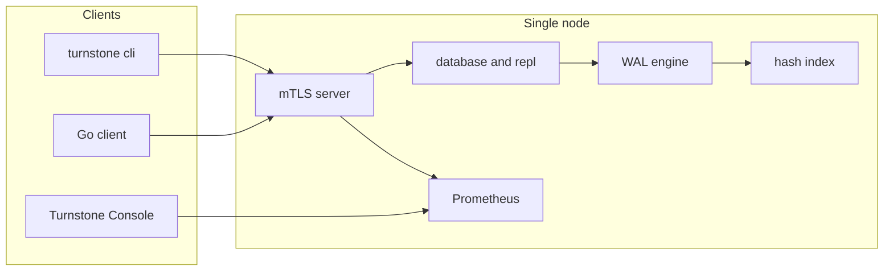

<!--
Copyright (c) 2026 Kiruba Sankar Swaminathan

This source code is licensed under the MIT license found in the
LICENSE file in the root of this source tree.
-->

# TurnstoneDB

TurnstoneDB is a persistent, transactional key-value store in Go. One binary opens a home directory on local disk, serves a binary protocol over mTLS, and keeps each logical database in its own keyspace (`SELECT 0`, `SELECT 1`, …).

The CLI and wire protocol feel Redis-like, but the storage model is different: writes go to a segmented write-ahead log, commits are durable via group `fsync`, and readers see snapshot isolation. You can replicate a database to followers and stream physical WAL backups for disaster recovery.

It is a **single-node store** with **optional replication**. It is not a distributed database — there is no Raft, sharding, or automatic failover.

> **Disclaimer:** TurnstoneDB is research-quality software. Group commit, MVCC, mTLS, and physical replication are implemented, but it is not recommended for mission-critical production use without further hardening.

## At a glance



**You get** ACID transactions with snapshot isolation; one process and local disk; Redis-style `SELECT` namespaces; optional primary → follower replication per database; physical WAL backup and restore; Prometheus metrics and a localhost Turnstone Console for development.

**You do not get** a SQL engine, lock waiting, Raft/Paxos, automatic failover, or scale-out sharding.

---

## Quick start

**Prerequisites:** Go 1.26+ (see `go.mod`)

```bash
git clone https://github.com/kirubasankars/turnstone.git
cd turnstone
make build
```

**1. Initialize** a home directory (TLS certs + `turnstone.json`):

```bash
./bin/turnstone init --home tsdata --ip 127.0.0.1,localhost
```

**2. Start the server** in development mode (auto-promote databases, no transaction timeouts):

```bash
./bin/turnstone server --home tsdata --dev
```

**3. Use the database** — interactive CLI or Turnstone Console:

```bash
./bin/turnstone cli --home tsdata
```

```text
0> begin
OK
0> set mykey hello
OK
0> commit
OK
0> begin read
OK
0> get mykey
OK: hello
0> commit
OK
```

The server listens on `:6379` by default. With `--dev`, the Console is at **http://127.0.0.1:8080**. Logical databases `0`–`N` are independent keyspaces.

---

## Data model and transactions

Keys are ASCII strings; values are opaque bytes. There is no SQL, schema, or secondary index — the durable source of truth is the WAL, and the in-memory hash index is rebuilt on open.

Every `get`, `set`, `del`, and multi-key variant runs inside a transaction:

| Step | What happens |
| --- | --- |
| `begin` | Open a snapshot-isolated read/write transaction |
| `begin read` | Open a read-only snapshot (no write locks) |
| `set` / `del` | Append to the WAL immediately (eager log) |
| `commit` | Group `fsync`, then mark the transaction committed |
| `abort` | Discard; uncommitted versions are not visible |

Conflicts are **first-writer-wins** (`NOWAIT`). A second transaction that writes the same key gets `ErrTxConflict` immediately and must retry. Production servers abort transactions older than 30 seconds; `--dev` disables that timeout and auto-promotes every database to `PRIMARY`.

Without `--dev`, databases start in `UNDEFINED` and must be `promote`d before they accept writes.

---

## Commands

Full flag reference: **[docs/cli.md](docs/cli.md)**

| Command | Purpose |
| --- | --- |
| `turnstone init` | Create home directory, TLS certs, and `turnstone.json` |
| `turnstone server` | Run the database (`--dev` for local use + Turnstone Console) |
| `turnstone cli` | Interactive REPL or `cli exec <command>` one-shot |
| `turnstone bench` | Load and throughput benchmark (`--ops` or `--duration`) |
| `turnstone backup` | Stream a physical WAL backup from a primary |
| `turnstone restore` | Restore WAL backups into a new home directory |

### REPL cheat sheet

Data commands need an open transaction. `cli exec` opens a new connection per invocation, so use the interactive REPL for `begin` / `set` / `commit` sequences.

| Command | Role | Notes |
| --- | --- | --- |
| `ping` | client | Health check |
| `select <db>` | client | Switch logical database |
| `begin` / `begin read` | client | Start a read/write or read-only transaction |
| `get` / `mget` | client | Read one or more keys |
| `set` / `mset` | client | Write one or more keys |
| `del` / `mdel` | client | Delete one or more keys |
| `commit` / `abort` | client | Finish the transaction |
| `stat` | client | JSON replication state, offsets, replica lag |
| `promote [min_replicas]` | admin | Become `PRIMARY`; optional sync quorum |
| `stepdown` | admin | Drain writes and return to `UNDEFINED` |
| `replicaof <host:port> <db>` | admin | Follow a remote primary |
| `flushdb` | admin | Wipe the selected database |

```bash
# Health check (one-shot; no transaction needed)
./bin/turnstone cli exec ping

# Admin failover (requires --admin cert)
./bin/turnstone cli --admin exec promote

# Benchmark (fixed op count)
./bin/turnstone bench --home tsdata --ops 10000 --concurrency 50

# Soak (30s mixed GET/SET)
./bin/turnstone bench --home tsdata --duration 30s --concurrency 50
```

---

## Turnstone Console

With `--dev`, TurnstoneDB serves a local read-only Console at **http://127.0.0.1:8080** (override with `--console-addr`).

| Section | What you can do |
| --- | --- |
| **Dashboard** | Live server stats, key counts, WAL/hash segment counts, GC/live bytes, and Prometheus tiles |
| **Metrics** | Time-series charts for server and database gauges |

The Console binds to localhost only. It is a development dashboard — not a production admin surface. Edit keys with `turnstone cli`.

---

## Replication and failover

Replication is configured **per database**. Each database follows:

`UNDEFINED` → `REPLICA` → `PRIMARY`

| Admin command | Effect |
| --- | --- |
| `replicaof <host:port> <db>` | Follow a remote primary |
| `stepdown` | Drain writes and return to `UNDEFINED` |
| `promote [min_replicas]` | Become primary; optional sync quorum |

**Manual failover (node A → node B):**

1. **Node A:** `select 1` → `stepdown`
2. **Node B:** `select 1` → `promote`
3. **Node A:** `select 1` → `replicaof <B>:6379 1`

There is no automatic leader election — an operator runs failover.

Sync replication (`promote N` with N > 0) waits for N follower ACKs after each commit. Backup streams do not count toward quorum.

---

## Backup and restore

Back up a running primary, then restore offline into a fresh home directory:

```bash
# Full WAL backup
./bin/turnstone backup --home tsdata --host localhost:6379 --db 1 --out backup_full

# Differential backup (smaller, resumes from previous end LSN)
./bin/turnstone backup --home tsdata --db 1 --type differential \
  --base-meta backup_full/backup.meta --out backup_diff

# Restore chain and serve
./bin/turnstone restore --chain backup_full,backup_diff --out restored_home
./bin/turnstone server --home restored_home --dev
```

See **[docs/cli.md](docs/cli.md)** for `backup.meta` schema, chain validation, and LSN semantics.

---

## Configuration and security

After `init --home tsdata`, the home directory looks like:

```
tsdata/
  turnstone.json       # server configuration
  certs/               # CA, server, client, and admin certificates
  data/
    0/                 # logical database 0
    1/
    ...
```

Highlights in `turnstone.json` (full field list: [config/README.md](config/README.md)):

| Field | Default | Description |
| --- | --- | --- |
| `port` | `:6379` | Listen address |
| `number_of_databases` | `4` | Highest logical database id (`0` … `N`) |
| `log_retention` | `replication` | WAL purge policy: `replication` or `none` |
| `max_disk_usage_percent` | `90` | Reject writes above this disk usage |
| `max_index_arena_bytes` | `0` | Reject writes when index arenas exceed this size (bytes); `0` disables |
| `metrics_addr` | `:9090` | Prometheus scrape address |

All connections use **mTLS**. Authorization is the certificate **Organization** field:

| Organization | Allowed to |
| --- | --- |
| `client` | Data commands and `stat` |
| `admin` | Failover: `promote`, `stepdown`, `replicaof`, `flushdb` |
| `server` | Replication streams between nodes |

`turnstone cli` loads `certs/client.crt` by default; pass `--admin` to use the admin pair.

---

## Go client

Embed [client](client/README.md) in application code. Connections require the CA plus a client certificate from `--home`.

```go
package main

import (
	"errors"
	"fmt"
	"log"

	"turnstone/client"
)

func main() {
	cl, err := client.NewMTLSClientHelper(
		"localhost:6379",
		"tsdata/certs/ca.crt",
		"tsdata/certs/client.crt",
		"tsdata/certs/client.key",
		nil,
	)
	if err != nil {
		log.Fatal(err)
	}
	defer cl.Close()

	if err := cl.Begin(); err != nil {
		log.Fatal(err)
	}
	if err := cl.Set("mykey", []byte("hello")); err != nil {
		log.Fatal(err)
	}
	if err := cl.Commit(); err != nil {
		if errors.Is(err, client.ErrTxConflict) {
			// retry with a new transaction
		}
		log.Fatal(err)
	}

	if err := cl.BeginReadOnly(); err != nil {
		log.Fatal(err)
	}
	val, err := cl.Get("mykey")
	if err != nil {
		log.Fatal(err)
	}
	fmt.Printf("%s\n", val)
	_ = cl.Commit()
}
```

Import path: `turnstone/client`. Retry `ErrTxConflict` and `ErrServerBusy` with backoff; the engine does not wait on key locks.

---

## Observability

| Surface | Address | Use |
| --- | --- | --- |
| Prometheus | `:9090` (configurable) | Scrape server and per-database metrics |
| Turnstone Console | `127.0.0.1:8080` (with `--dev`) | Live dashboard, WAL/GC stats, and charts |
| `stat` command | CLI | JSON replication state, offsets, replica lag |

---

## Limitations

1. **Single node** — one process, local disk; scale-out needs application-level sharding.
2. **Manual failover** — no Raft/Paxos; operators run `stepdown` / `promote`.
3. **No lock waiting** — hot-key conflicts return immediately; clients must retry.
4. **Keys and bytes only** — not SQL.

---

## Documentation

| Topic | Guide |
| --- | --- |
| CLI reference | [docs/cli.md](docs/cli.md) |
| Architecture and reading order | [docs/README.md](docs/README.md) |
| Go client | [client/README.md](client/README.md) |
| Storage engine internals | [engine/README.md](engine/README.md) |
| Replication | [database/README.md](database/README.md), [repl/README.md](repl/README.md) |
| Wire protocol | [protocol/README.md](protocol/README.md) |
| Configuration | [config/README.md](config/README.md) |
| Package index | [docs/README.md](docs/README.md) |

---

## License

MIT — see [LICENSE](LICENSE).
