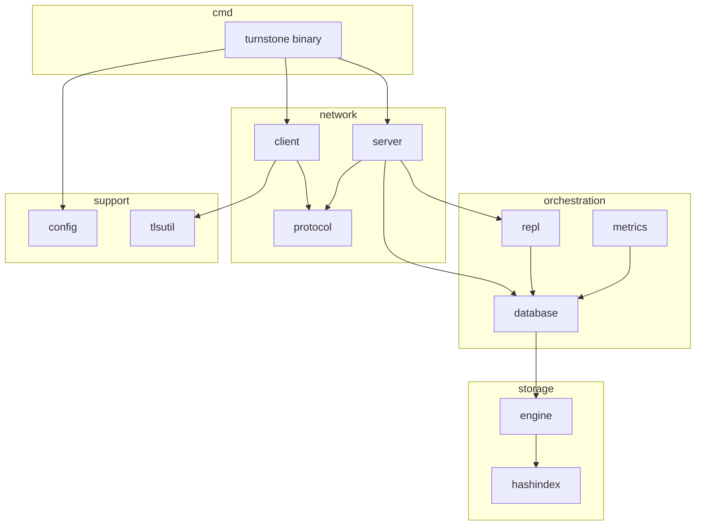

# TurnstoneDB documentation index

This index links operator guides and **per-package README files** for education and code review. Start with the [root README](../README.md) for a project overview and [cli.md](cli.md) for day-to-day CLI usage; use this map to navigate the codebase by layer.

## Suggested reading order (new contributors)

1. [cmd/turnstone](../cmd/turnstone/README.md) — how binaries start the system
2. [protocol](../protocol/README.md) — wire contract between client and server
3. [server](../server/README.md) — connection handling and RBAC
4. [database](../database/README.md) — replication roles and retention orchestration
5. [engine](../engine/README.md) — WAL, MVCC, transactions
6. [engine/hashindex](../engine/hashindex/README.md) — in-memory index internals

Then branch by interest:

- **Security / ops:** [config](../config/README.md), [internal/tlsutil](../internal/tlsutil/README.md), [metrics](../metrics/README.md)
- **Replication:** [repl](../repl/README.md), [server/replication tests](../server/replication_test.go)
- **Client embedding:** [client](../client/README.md)

## Operator documentation

| Topic | Path |
| --- | --- |
| CLI reference (`init`, `server`, `cli`, `bench`) | [cli.md](cli.md) |

## Package documentation

| Layer | Path | README |
| --- | --- | --- |
| CLI | `cmd/` | [cmd/README.md](../cmd/README.md) |
| CLI binary | `cmd/turnstone/` | [cmd/turnstone/README.md](../cmd/turnstone/README.md) |
| Wire protocol | `protocol/` | [protocol/README.md](../protocol/README.md) |
| Go client | `client/` | [client/README.md](../client/README.md) |
| Configuration | `config/` | [config/README.md](../config/README.md) |
| Network server | `server/` | [server/README.md](../server/README.md) |
| DB + replication | `database/` | [database/README.md](../database/README.md) |
| Outbound repl | `repl/` | [repl/README.md](../repl/README.md) |
| Storage engine | `engine/` | [engine/README.md](../engine/README.md) |
| Hash index | `engine/hashindex/` | [engine/hashindex/README.md](../engine/hashindex/README.md) |
| Internal utils | `internal/` | [internal/README.md](../internal/README.md) |
| TLS helpers | `internal/tlsutil/` | [internal/tlsutil/README.md](../internal/tlsutil/README.md) |
| Metrics | `metrics/` | [metrics/README.md](../metrics/README.md) |
| CI | `.github/` | [.github/README.md](../.github/README.md) |

## Layer diagram

## Review-focused checklists

Each package README ends with a **review checklist** and **suggestions** section. When reviewing a PR:

1. Identify the primary package(s) touched.
2. Open the corresponding README checklist.
3. Cross-check root README semantics (transactions, replication, retention) if behavior changes.

## Documentation suggestions (repo-wide)

| Area | Suggestion |
| --- | --- |
| On-disk format | Standalone `docs/wal-format.md` generated from `engine/encode.go` constants |
| Protocol | Non-Go client guide with hex dumps of sample frames |
| Operations | Runbook for manual failover with expected `STAT` output at each step |
| Architecture decision records | `docs/adr/` for major choices (eager logging, no Raft, ephemeral index) |
| Diagrams | Sequence diagrams for sync replication quorum and stepdown drain |
| Learning path | Annotated walkthrough: trace one `SET` from CLI to disk bytes |

Contributions that add new top-level packages should include a `README.md` in the same style as existing folders.
